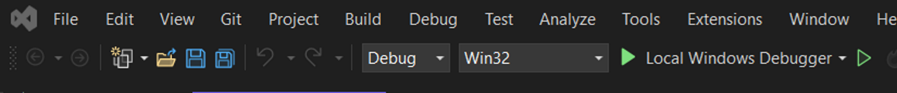

# Installation and Configuration of Control.exe

This file describes how to install and configure Control.exe and ControlAPI. It is assumed that you have installed Visual Studio C++ 2022 with MFC (Microsoft Foundation Classes, or Afx) support.

*Table of content*  

1. [Control.exe](#controlexe)
   - [Configuration of Control.exe](#configuration-of-controlexe)
   - [Specifying hardware configuration](#specifying-hardware-configuration)
   - [Specifying user IO configuration](#specifying-user-io-configuration)
   - [Option for cleaner looking, 3x faster C code](#option-for-cleaner-looking-3x-faster-c-code)
2. [Data acquisition using Vision](#data-acquisition-using-vision)

Back to [Overview](../README.md).

&nbsp;

## Control.exe

Control.exe is a full-fledged experiment control system. It's also the basis of ControlAPI. The code is in _Control_Firefly_AQuRA_. 
To compile it, install [Visual Studio 2022 with MFC](InstallationOfVisualStudio.md) and load the solution into Visual Studio C++ 2022 by double clicking on _Control.sln_.

To compile _Control.exe_ and not _Control.dll_ in Visual Studio, go to Solution Explorer (Ctrl+Alt+L), right click on "Control" (not " Solution Control" ) and select EXE under Configuration Properties -> General-> Configuration Type.  
You can select Win32 or x64 and debug or release in Visual Studio's dropdown menus. 



I recommend Win32 debug, as it compiles much faster in debug mode then x64. It's thereby easier to change CSequence.cpp and quickly resume operating the experiment when needing to make changes to CSequence code blocks (which is usually not all that often). 
If you came from DLL and switched to EXE, you might have to select exe in the dropdown menu marked below as "Local Windows Debugger", see little white downwards arrow.

### Configuration of Control.exe

Control.exe configures itself from configuration files. It searches for "config.txt" in the folder that contains the executable, in the three folder levels closer to the root folder, and in any "ConfigParams" folder relative to those folders. If it finds a "_config.txt_" file that is empty, it will look for all other configuration files in the folder in which the empty "config.txt" file was found. If the _config.txt_ file is not empty, its first line (terminated by new line) will be used as config file path. If no _config.txt_ is found, the first argument passed to control.exe is used as configuration file path.

The main configuration files are  
_ControlParam_ParamList.txt_  
_ControlParam_SystemParamList.txt_  
_ControlParam_UniMessList.dat_  
_ControlParam_UtilityDialog.txt_  
and are typically contained in the folder  
_\[Installation path\]\\Control_Firefly_AQuRA\\ConfigParams\\_

All other paths and files are set in the configuration file  
_ControlParam_SystemParamList.txt_ (not _ControlParam_ParamList.txt_)  
e.g.  
_WorkingDirectory=._  
_HardwareConfigFilename=ControlHardwareConfig.json_  
_UserIOConfigFilename=ControlUserIOConfig.json_  
_UserIOAlternativeCommandNames=AlternativeCommandNames.txt_  
_DebugFilePath=..\\DebugFiles\\_  
_VirtualOsciFilePath=..\\OpticsFoundry_Control_AQuRA\\VirtualOsci\\_  
_DataFilePath=..\\Data\\_  
_SourceFilePath=..\\OpticsFoundry_Control_AQuRA\\_  
_CalibrationFilePath=..\\OpticsFoundry_Control_AQuRA\\Calibrations\\_  
_ParameterReferenceFileName=ReferenceParam_  
_UserParameterASCIIFileName=..\\DebugFiles\\OutputList.txt_  
_UserParameterFileName=ReferenceParam.dat_  
_OutputListFilename=..\\DebugFiles\\OutputList.dat_  
_OutputListFilenameComputerReadable=..\\DebugFiles\\OutputListCR.dat_  
and more (further down in the file).

If the _WorkingDirectory_ is empty (i.e. "WorkingDirectory=" (no dot) instead of "WorkingDirectory=."), then the working directory will not be changed on program start (it typically is then the location of the exe file). If _WorkingDirectory=._ (i.e. a dot), then the working directory will be changed to the directory in which _config.txt_ was found, i.e. typically _\[Installation path\]\\Control_Firefly_AQuRA\\ConfigParams\\_. Relative filenames and directories (i.e. not starting with the drive, e.g. C:\\) are relative to the working directory ("..\\" means go one level closer to the root directory).

Make sure the screen coordinates at which the Control window appears is on your screen, e.g.  
_MainDialogStartX=0_  
_MainDialogStartY=0_  
It's convenient to set this to appropriate values in multi-screen setups, but it can lead to a hidden window when switching screen setups.

The hardware configuration file _ControlHardwareConfig.json_ is created by opening the _Control_Firefly_AQuRA_ folder (not the _Control_Firefly_AQuRA\\ConfigParams_ folder!) in Visual Studio code and running the Python script  
_ConfigParams\\ControlHardwareConfigFileCreator.py._  
The json file is then created in the _ConfigParams_ folder (verify that, if something doesn't work). After this json file has been successfully generated, the IO configuration file _ControlUserIOConfig.json_ is created by running  
_ConfigParams\\ControlUserIOConfigFileCreator.py_  
For convenience this Python script also provides an overview of your address usage in the file  
_ConfigParams\\AddressUsageTable.txt_  

Take a look at the _\__main___ function in the two Python files below to understand how one can define hardware and UserIO configurations.

The Python scripts check that all provided data is consistent, e.g. that a desired IO output actually is configured on a certain address, that an address is only used once, and that limitations on address usage are adhered to, e.g. that AD9858 addresses are a multiple of 4.

After running _Control.exe_ for the first time, you can adjust the size of the dialog window to your screen. You do this by opening _Control.rc2_ using the Solution Explorer in Visual Studio C++, opening _Dialog -> IDD_EASYDIALOG_ and dragging the dialog window to a suitable size. If your screen is very small or large, you might want to adjust the number of elements displayed in each menu column by editing _DialogElement.cpp_ and setting _MaxLines_ to what you need. (Btw, you can also edit the size of all other GUI components in the table of constants in this file.)

In _UniMessList.h_ you can adjust the maximum number of UniMess entries in the Measurement Menu to make them fit the screen:  
_const unsigned int MaxNrUniMess=76;_  
If you find menus with more columns then you can display, insert _NewMenu_ commands as appropriate, see manual below.


### Specifying hardware configuration


Here an example hardware configuration file generator Python script:

```py
if __name__ == "__main__":
   builder = ConfigBuilder()
   builder.RegisterSequencer(IP="192.168.0.109", Port=7, ClockFrequency=100000000, BusFrequency=2000000, DebugOn = False)
   analog_out_configs = [
       (24, False, 0, 10),
       (28, True, -10, 10),
       (32, True, 0, 10),
       (36, True, -10, 10),
       (40, True, -10, 10)
   ]
   for addr, signed, minv, maxv in analog_out_configs:
       builder.RegisterAnalogOutBoard16bit(StartAddress=addr, Signed=signed, MinVoltage=minv, MaxVoltage=maxv)
   for addr in [1, 2, 3, 4, 5, 6]:
       builder.RegisterDigitalOutBoard(Address=addr)
   for addr in range(132, 172, 4):
       builder.RegisterDDSAD9854Board(Address=addr)
  
   for addr in range(52, 84, 4):
       builder.RegisterDDSAD9858Board(Address=addr)
  
   builder.RegisterDDSAD9958Board(Address=21)
   builder.Save()
```


### Specifying user IO configuration


Here an example IO configuration file generator Python script:

You can specify ranges for analog outputs and DDS frequency outputs. Control will not send output values beyond these ranges to the outputs. This option exists to protect hardware, such as RF amplifiers, from destruction.


```py
if __name__ == "__main__":
    builder = UserIOConfigBuilder()
    
    builder.add_new_menu(Text="AQuRA User IO")
    builder.add_static_text(Text="AQuRA Analog Outs")
    builder.add_analog_out(Name="MOTCoilCurrent", Description="Current in MOT Coils", Address=31, Units="A", Max=23.0, Init=0.0, Calibration = [
                {"order": 0, "value": 0},
                {"order": 1, "value": 0.1}
            ])
    builder.add_analog_out(Name="ChillerSetpoint", Description="Chiller temperature setpoint", Address=30, Units="degC", Max=5.0, Init=0.0)    
    builder.add_analog_out(Name="LatticePowerSetpoint", Description="Lattice power setpoint", Address=29, Units="%", Max=5.0, Init=0.0)
    builder.add_analog_out(Name="PMTGain", Description="Photomultiplier tube gain", Address=28, Units="", Max=5.0, Init=0.0)
    builder.add_static_text("")

    builder.add_static_text(Text="AQuRA Digital Out")
    builder.add_digital_out(Name=f"OscilloscopeTrigger", Description=f"Oscilloscope Trigger", Address=3, Bit = 0)
    builder.add_digital_out(Name="CameraTrigger0", Description="Camera Trigger 0", Address=3, Bit=1)
    builder.add_digital_out(Name="CameraTrigger1", Description="Camera Trigger 1", Address=3, Bit=2)
    builder.add_digital_out(Name="SwitchPMTTrigger", Description="PMT Trigger", Address=5, Bit=3)
    builder.add_new_menu(Name="User IO DDS Out Menu")
    builder.add_dds_ad9854(Name="UserIOTestDDSAD9854_0", Description="Test DDS AD9854 0", Address=132, FrequencyControl= "FrequencyAsBinary")
    builder.add_dds_ad9858(Name="UserIOTestDDSAD9858_0", Description="Test DDS AD9858 0", Address=52, PowerControl="PowerIndB", InitFrequency=77.0, InitPower=-10, MinFrequency=60.0, MaxFrequency=100.0)
    builder.add_dds_ad9958(Name="UserIOTestDDSAD9958_0", Description="Test DDS AD9958 0", Address=21)
    builder.add_new_column()
    builder.add_static_text(Name="AQuRA AD9854 DDS")
    builder.add_dds_ad9854(Name="CoarseSpectroscopyAOM", Description="Coarse Spectroscopy AOM", Address=136)
    builder.save()
```

&nbsp;

### Option for cleaner looking, 3x faster C code


There is one little twist to the story of configuring user IO through JSON files. To write the cleanest code and obtain the highest speed, one would like to write commands such as  
_SetMOTCurrent(InitialMOTCurrent);_  
_SwitchZeemanSlowerShutter(On);_  
However, using only JSON configured outputs, one doesn't immediately obtain C functions named correctly. This is a limitation coming from the fact that C is a compiler. The directly available way of calling JSON configured user IO is through lookup functions "AnalogOut" and "DigitalOut":  
_AnalogOut("SetMOTCurrent", InitialMOTCurrent);_  
_DigitalOut("SwitchZeemanSlowerShutter", On);_  

In order to also obtain C functions setting these outputs, we can auto-generate the required C code and include it in the source code of control. The advantages are 3x higher speed when calling output commands while assembling a sequence (a few hundred nanoseconds, instead of up to a few microseconds) and cleaner looking code. (The output speed on hardware is unchanged.)

The C code is autogenerated on startup if the following is set in the configuration file _ControlParam_SystemParamList.txt_:  
_DoCreateIOListShortcuts = TRUE_  
_DebugFilePath=..\\DebugFiles\\_  
After starting control.exe you will find the files  
_\[DebugFolder\]\\IOList_shortcuts_auto_create.h_ and _.cpp_  

Copy those into the source code folder and recompile.  
(If you let control.exe create those files directly in the source code folder, and if you inadvertently leave the DoCreateIOListShortcuts option on, Visual Studio will detect that the date of these files has changed and recompile control.exe every time you start it, wasting your time, even if the content of those files has not changed and recompiling is not needed.)

Now you can use  
_SetMOTCurrent(InitialMOTCurrent);_  
_SwitchZeemanSlowerShutter(On);_  
just, as if you had defined those outputs in the "old-fashiond way" in IOList.cpp.

The _IOList_shortcuts_auto_create.h_ and _.cpp_ need to be regenerated every time a new UserIO entry is added to the json file in order to define a C function accessing that user IO.

This trick is not relevant when using Control as an API through a dll or through python bindings, as we access the outputs through the API, i.e. using  
_Command("SetMOTCurrent(InitialMOTCurrent);");_  
_Command("DigitalOut("SwitchZeemanSlowerShutter", On);");_  
which is converted automatically into the command lookups  
_AnalogOut("SetMOTCurrent", InitialMOTCurrent);_  
_DigitalOut("SwitchZeemanSlowerShutter", On);_  

Similarly,  
_\[DebugFolder\]\\ParamList_shortcuts_auto_create.h_ and _.cpp_  
need to be copied into source folder and give access to the initialization parameters of all outputs selected by the user in the initial parameter menus, by providing pointers to those parameters. These parameters can be useful if one wants to intermittently set an output back to its initial value, e.g. for the heating of AOMs.

If you remove an output from the configuration file, the corresponding C function will remain in the _IOList_shortcuts_auto_create.h_ and _.cpp_ files until you regenerate those files. 
If you did not yet regenerate those files, you will get a warning when starting Control.exe. Just ignore that warning and regenerate those files.


&nbsp;

## Data acquisition using Vision

Control.exe directly supports the [Vision](https://github.com/opticsfoundry/Vision_AQuRA) data acquisition system and can easily be adapted to others.

