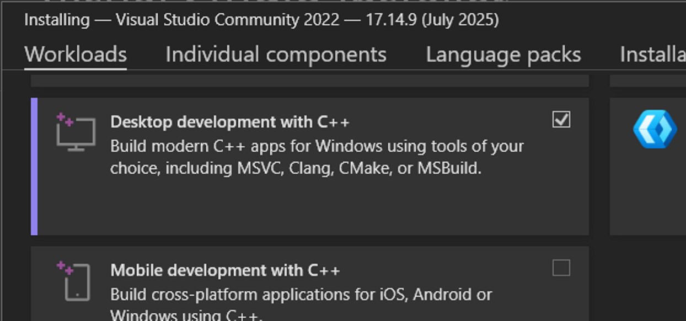
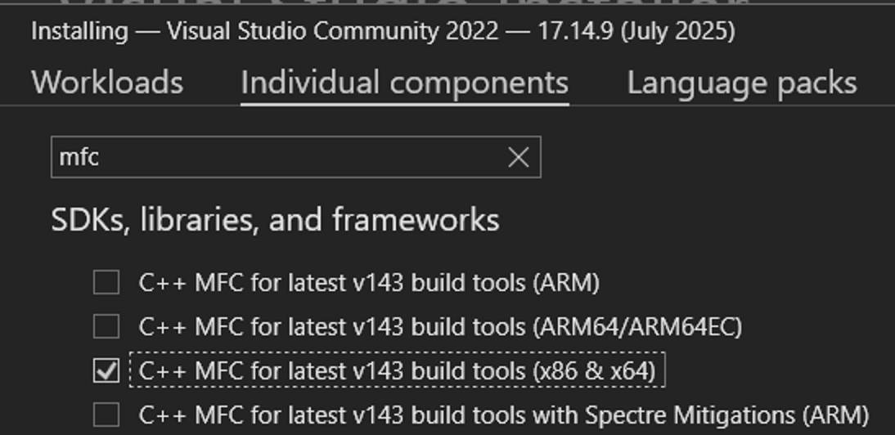

# Installation of Visual Studio 2022 and MFC

Install Visual Studio 2022 Community Edition. In the installer, select the Workload "Desktop development with C++" 

and the individual component "C++ MFC for latest v143 build tools (x86 & x64)" 

then install.

Back to [Overview](../README.md).
