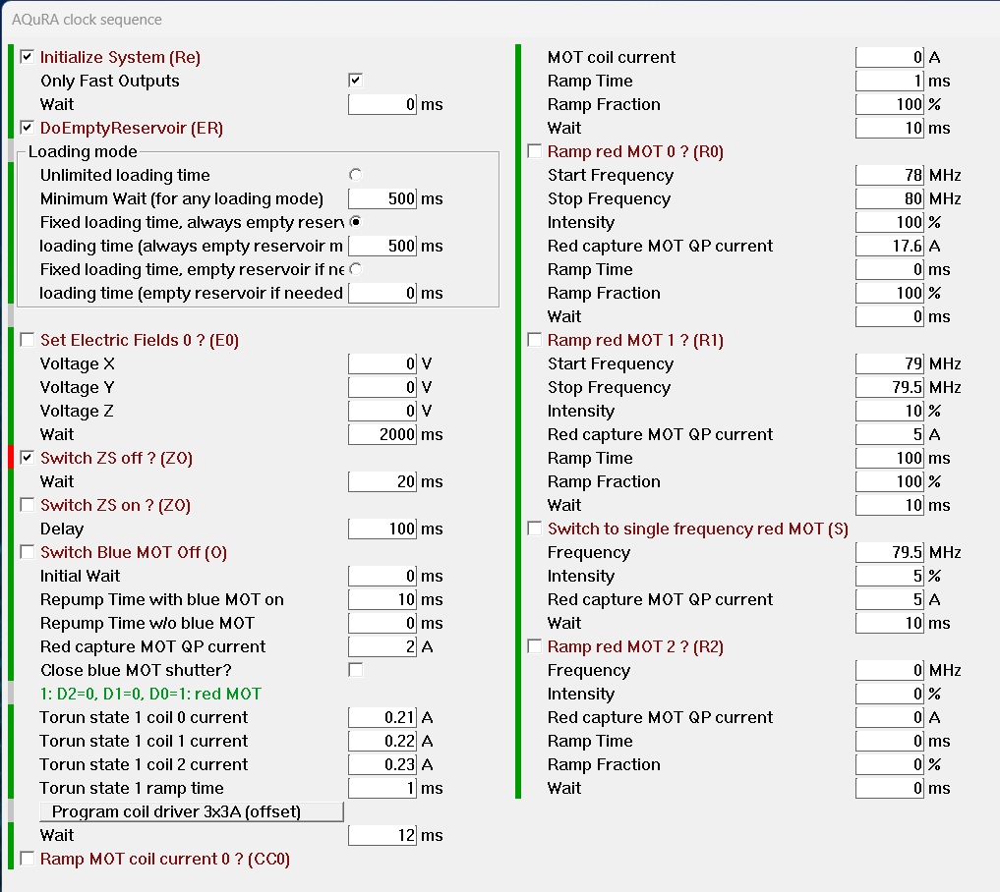
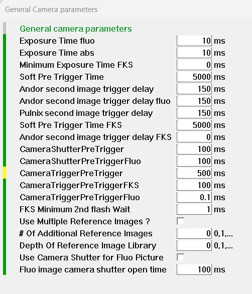

# User Interface

*Table of Contents*

1. [Main Dialog](#main-dialog)
2. [Manual Operation Dialog](#manual-operation-dialog)
3. [Initial Parameters Dialog](#initial-parameters-dialog)
4. [Experimental Sequence Dialog](#experimental-sequence-dialog)
5. [Measurement dialog](#measurement-dialog)
6. [Useful Utilities](#useful-utilities)
7. [System configuration parameters](#system-configuration-parameters)

Back to [Overview](../README.md)

&nbsp;

## Main Dialog

The main dialog of Control.exe is shown below.


It contains the following elements:  

Manual operation: enables manual control of outputs

Parameter menus, top part: initialization parameters of outputs. The outputs will be set to those values when Control.exe is started, when the button "Reset System" is pressed, or when ResetSystem is executed at the end of an experimental run.

Parameter menus, bottom part: code blocks of the experimental sequence

Utilities: utilities to e.g. run the AQuRA clock (i.e. stabilize the frequency comb on the Sr clock transition), or test the IO system.

Configurable dialogs are automatically created through [configuration files](InstallationAndConfigurationOfControlEXE.md#specifying-user-io-configuration), 
[sequence code blocks](ProgrammingSequences.md#experimental-sequence-code-blocks) or [utility code blocks](ProgrammingSequences.md#utilities).  
It is likely that the screenshots shown below do not correspond exactly to the ones that you will see, as the configuration files and code blocks are often modified.

&nbsp;


## Manual Operation Dialog

An example manual operation dialog is shown below.


The outputs can be changed by typing new values into the dialog boxes or checking the check boxes. The new values are sent to the output ports by clicking into the grey area of the control panel or clicking "Apply" or "Ok". The changes are not applied and the menu is left by clicking "Cancel" or closing the dialog box.
The C++ internal names of the outputs are displayed when clicking or hovering the mouse over the yellow areas.

&nbsp;


## Initial Parameters Dialog

The initial parameters dialog is shown below. 


This menu looks similar to the manual control menu. It contains the initialization parameters. These values are stored on disk when the program quits and loaded again when it starts. These values are used to initialize the outputs when the "Reset System" button is clicked or ResetSystem() is called.

&nbsp;

## Experimental Sequence Dialog

An experimental sequence is run by   
- clicking the "Run Experiment" button in the main dialog  
- starting a measurement series from the measurement dialog  
- starting a measurement queue containing multiple series or individual runs.  

Short helper sequences can be defined in _Sequence_Utilities.cpp_ and run by clicking the corresponding button in the Utilities Dialog.

An experimental sequence consists of a sequence of code blocks, as described in [Experimental sequence code blocks](ProgrammingSequences.md#experimental-sequence-code-blocks). 
Each code block depends on parameters, which can be set in the parameter menus. The code blocks are executed in the order they appear in the table, if they are selected by the check box on the left.

An experimental sequence starts with code blocks executed in direct mode, as specified in _Sequence_Main.cpp_, _bool CSequence::MainExperimentalSequenceStartInDirectOutputMode(CWnd* parent)_. 
The parameter dialog for this direct mode code block can for example look like this:


The colored blocks to the left of each parameter are green if the parameter has not been changed since the last time the reference parameter file was saved (using the "Save parameters" button in the "File" dialog), and red if it has been changed. 
The color is yellow or orange if a help text is available for a parameter. Hover the mouse over the colored block or click it to display the help text.


After the direct mode code blocks, the experimental sequence continues with code blocks executed in waveform mode, as specified in _Sequence_Main.cpp_, _bool CSequence::MainExperimentalSequenceTimedMode(CWnd* parent)_. 
The parameter dialog for this waveform mode code block can for example look like this:



If you want to take fluorescence or absorption images, you can use the code in _Sequence_Imaging.cpp_, which corresponds to the imaging dialogs 


The camera parameters are selected in the camera parameter dialogs


Parameters that are general for all cameras are set in the following dialog.




After the sequence execution in waveform mode has finished, additional operations can be done in direct output mode, such as reading in input data, preparing the next run or resetting the system. 
The parameter dialog for this final stage can look like the following.


&nbsp;

## Measurement dialog

A series of experimental runs can be started from a measurement dialog. The list of all measurement dialogs appears when clicking the "Measurements" button in the main dialog.


When clicking on any of these measurement buttons, the corresponding measurement dialog appears. Below the example of a lifetime measurement is shown.


Each measurement can vary up to four parameters. 
The parameter can be chosen using the drop down menus. If you want to know the name of a certain parameter, then click onto the colored box next to the parameter in the parameter dialogs (or hover your mouse over that box). 
The parameters are listed in the order in which they appear in the parameter dialogs. As a guide, the names of the parameter dialogs are also shown in this list, preceded by "***". 
Using these dialog names as guides, it is relatively easy to find a parameter.

The parameters can be changed in steps of a fixed size (from "Start Value" to "Stop value" in "Number of points" steps), or by specifying a list of values in the ASCII file given in the "Value List File Name" box.  
The value list file has the format   
```
NrPoints
Value1
Value2
Value3

```
(There must be [NrPoints] values in the list, one per line. Each line must be terminated by enter.)


The button "Execute" executes the measurement series directly.  
The button "Queue measurement" adds the measurement to a queue of measurements, which can be launched by clicking "Run measurement queue" in the main measurement dialog.  
The "Measurement name" will be shown on the buttons in the main measurement dialog (after a change: only after it is reopened).  

If a parameter name is empty, that parameter is not varied.

If more than one parameter is selected, the measurements will be arranged in a 2D, 3D or 4D matrix. Often one is only interested in the diagonal entries of this matrix. This can be selected by checking "Link".

A measurement series can be "Randomized", which converts experimental drifts into noise. 

It is possible to execute a "Reference run" every "Reference period" runs. Such a reference measurement must be defined by clicking the "Reference queue experiment" button in the main menu, which defines the current set of parameters as the ones for the reference run.

Each measurement series will be executed "Repetition" times.

If you want to add data points to an ongoing measurement series, check "Continue Series" and launch additional runs with "Execute".

You can start a measurement from a certain point in the series, given in "Start measurement point". This is useful when something went wrong with the execution of a long series. It also works for randomized series, as they use pseudo-random numbers with the same seed.


&nbsp;


## Useful Utilities 

There are various utilities that can be used to test the hardware or perform specific tasks. Some particularly useful ones are described below.


The measured ethernet bandwidth should be around 300MBit/s.


Test Vision Command sends the command in  the edit box to Vision. "VisionGridOnOff" switches a grid over the result picture on or off, which can be used to quickly verify that Control and Vision communicate correctly.

"Test Vision" runs an image taking sequence as specified by the parameters of the main experimental sequence. If "Use external trigger" is clicked, the cameras' trigger inputs need to be connected to the trigger outputs of the control system.

"Trigger cameras" triggers all cameras. It's useful when the camera servers are stuck, waiting for triggers to arrive.


Tests analog or digital outputs and analog inputs by recording an output on an analog input. The user should connect a signal of interest, e.g. a digital output port or an analog output port or any other voltage signal (-10..10V), to an analog input port. The standard SPI port settings are shown here. The recoded data is saved in the "Data" folder.


Utilities that blink the bits of the data and address bus. This can be used together with the bus LED debug board to quickly check if all bus signals reach the rackslot of interest correctly.

&nbsp;

## System configuration parameters

The first dialog page contains system configuration parameters, such file names or enabling the connection to a certain TCP/IP connected device or software component. 
These parameters are identical to the ones in the file _OpticsFoundry_Control_AQuRA\ConfigParams\ControlParam_SystemParamList.txt_. 
Especially the file names can be more easily changed by editing that text file.


The second page contains debug options. If one is selected, debug files are created in the DebugFiles folder. These options should be off when not debugging.
To switch some of the debug features on or off, the code has to restarted, as specified in the comment of those features.


